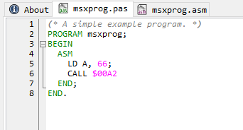
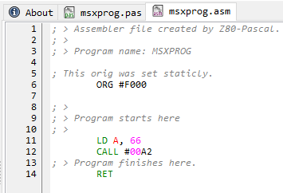
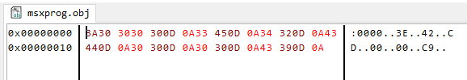

File editor
===========
The file editor can display a number of different

Pascal code
--------------
This type of files are opened with a text editor and Pascal syntax highlighter.

Assembler code
--------------
This type of files are opened with a text editor and assembler syntax
highlighter.

Object files
------------
Object files are generated by the assembler. On opening this type of files a hex
editor is displayed.

PCB editor
----------

.. WARNING::
   This module is not yet or just partially implemented!

To edit PCB designs a special PCB editor is opened.

Other files
-----------
All other unrecognized file types will be opened as text.
