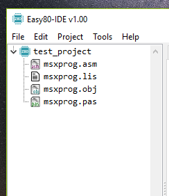

Project explorer
================
The project explorer displays all the files in a project folder. It allows to
do some basic management of the files, like creating new files and folders and
opening them in the editor.

